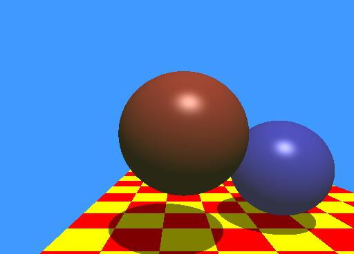

The first checkpoint, setting the scene, set the scene to resemble the raytracing scene from Whitted, 1980.
Godot was used to render the scene and values are stored in the "CSCI711 Raytracing Checkpoint 1" PDF file.

The second checkpoint, Raytracing Framework, using the values from checkpoint 1, 
Trace rays though the camera to produce an image
Non-recursive ray tracing
Visible surface determination
If no intersection, use background color.

The third checkpoint, Basic Shading, Implemented Phong Illumination Model for Shading 

The fourth checkpoint, procedural texture shading to create a checkerboard floor

