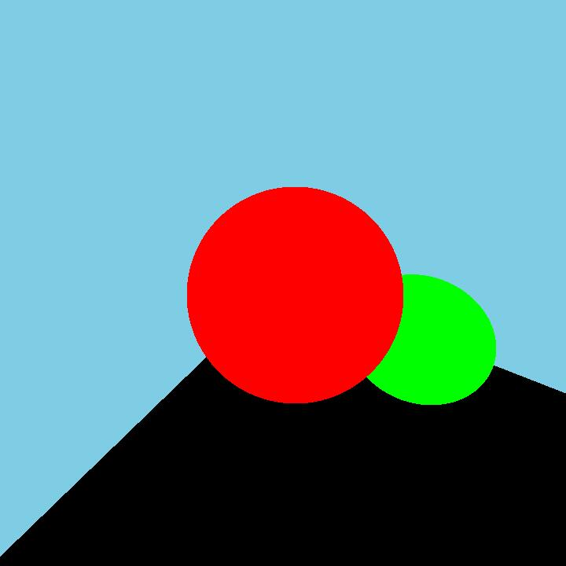
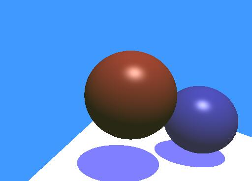
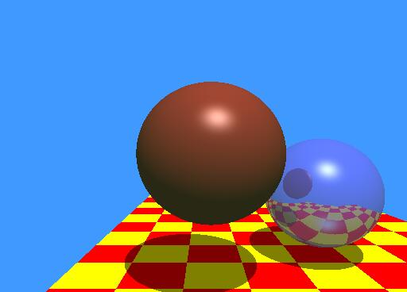
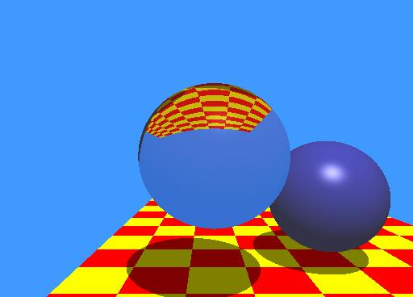
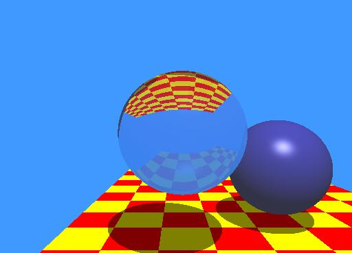

The 1st checkpoint, setting the scene, set the scene to resemble the raytracing scene from Whitted, 1980.
Godot was used to render the scene and values are stored in the "CSCI711 Raytracing Checkpoint 1" PDF file.

The 2nd checkpoint, Raytracing Framework, using the values from checkpoint 1, 
Trace rays though the camera to produce an image
Non-recursive ray tracing
Visible surface determination
If no intersection, use background color.

The 3rd checkpoint, Basic Shading, Implemented Phong Illumination Model for Shading 

The 4th checkpoint, procedural texture shading to create a checkerboard floor 

The 5th checkpoint, Recursive raytracing, Implemented reflections 

The 6th checkpoint, Implementing refractions 
1.0 index of refraction 

1.33 index of refraction 

1.33 index of refraction and 0.1Kt for reflection 

1.5 index of refraction 

1.5 index of refraction and 0.1Kt for reflection 

The 7th checkpoint, Implementing Tone Reproduction with Reinhard and Ward Models. 
To change the Illuminace Range a lightscale constant (0.5 for Low, 2.5 for Med, 5.0 for High) was multipled to each light color.

Ward Model Lo-Range lighting (0.5 Scaling) 

Ward Model Mid-Range lighting (2.5 Scaling) 

Ward Model Hi-Range lighting (5.0 Scaling) 

Reinhard Model Lo-Range lighting (0.5 Scaling) 

Reinhard Model Mid-Range lighting (2.5 Scaling) 

Reinhard Model Hi-Range lighting (5.0 Scaling) 

